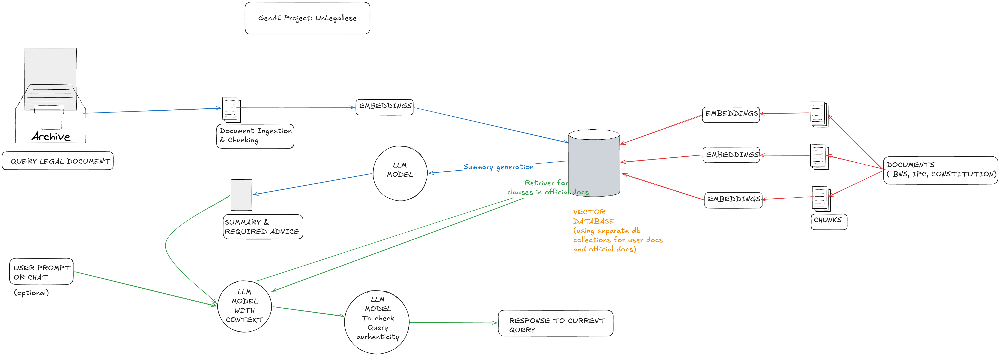

# ⚖️ UnLegalese

**Demystifying Complex Legal Documents into Plain English**

UnLegalese is an AI-powered Retrieval-Augmented Generation (RAG) platform engineered to parse, summarize, and explain complex legal notices and contracts under Indian Law. Built with Streamlit, ChromaDB, and Google Gemini, it pairs document clause analysis with relevant statutory provisions—such as the *Bharatiya Nyaya Sanhita (BNS)*, *Consumer Protection Act*, and *Indian Contract Act*—to provide verified, plain-English legal breakdowns.

🌐 **[Live Demo](https://unlegalese.streamlit.app/)**

---

## 🛠️ Tech Stack

* **Frontend & UI**: Streamlit
* **Core Language**: Python 3.12+
* **LLM & Orchestration**: Google Gemini (`gemini-3.5-flash-lite`), LangChain
* **Parsing & OCR**: PyMuPDF (`fitz`), Tesseract OCR, Pillow
* **Vector Store & Embeddings**: ChromaDB, HuggingFace (`all-MiniLM-L6-v2`)

---

## 🌟 Key Features

* **📄 Hybrid Document Ingestion:** Uses PyMuPDF for digital PDFs and falls back to **Enhanced Tesseract OCR** (with dark mode color inversion and contrast enhancement) for scanned PDFs and image uploads (`.png`, `.jpg`, `.jpeg`).
* **🔍 Dual-Collection MMR Retrieval:** Employs Max Marginal Relevance (MMR) search across two isolated vector collections to balance relevance and chunk diversity:
  1. **User Document Store:** Query-scoped vector search filtered strictly by document UUID (`doc_id`).
  2. **Statutory Reference Store:** Pre-populated collection of Indian statutory laws.
* **🔄 Legal Query Translation (Sub-Query Rewriter):** Automatically translates informal user questions (*"Can I sue them back?"*) into formal Indian legal concepts (*"criminal intimidation BNS 351 extortion defamation"*) to ensure precise statutory section retrieval.
* **🛡️ Two-Stage Anti-Hallucination Guardrail:** 
  - **Scope Verification:** Automatically detects non-legal documents (e.g., college syllabi or technical papers) and safely rejects applying false legal liabilities.
  - **Compliance Audit:** A second-pass LLM auditor verifies that cited statutory sections match source context before rendering text to the user.
* **💬 Conversational Memory:** Multi-turn chat interface via `st.chat_message`, allowing users to request draft reply notices or follow-up legal strategies based on previous turns.
* **🧹 Lifecycle & Privacy Management:** Staged disk files are cleaned up immediately after chunking, temporary embeddings are purged upon document switching, and stale sessions auto-purge on startup.

---

## 🏗️ System Architecture



```text
[ User Upload (PDF/Image) ]
            │
            ▼
[ OCR / Text Parser (PyMuPDF + Tesseract) ]
            │
            ▼
[ Chunking & Metadata Tagging (LangChain) ]
            │
            ├──► [ Immediate Disk Cleanup ]
            │
            ▼
[ Vector Storage (ChromaDB - User Collection) ]
            │
            ├─────────────────────────────────────────┐
            ▼                                         ▼
[ Document MMR Retrieval ]               [ Query Translation ]
            │                                         │
            │                                         ▼
            │                       [ Statutory MMR Retrieval ]
            │                         (BNS / Contract Act)
            └────────────────────┬────────────────────┘
                                 ▼
                      [ Gemini Primary Chain ]
                                 │
                                 ▼
                    [ Anti-Hallucination Audit ]
                                 │
                                 ▼
                      [ Streamlit Chat UI ]